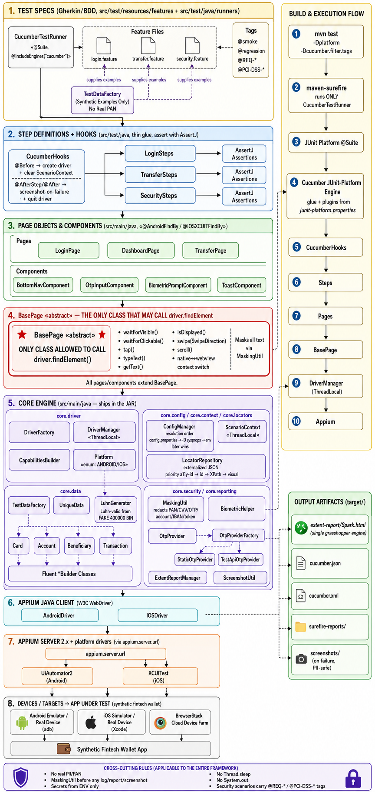

# Fintech Mobile QA Automation with Appium

Mobile QA automation framework for a **synthetic fintech wallet** app, built with
**Appium + Cucumber + JUnit Platform** on **Java 17 / Maven**.

The framework is fintech-hardened by design:

- **No real PII / PAN, ever.** Cards are Luhn-valid but use clearly-fake test BINs
  (e.g. the `400000` test range). Account numbers are synthetic and masked.
- **Everything sensitive is masked** (PAN, CVV, OTP, account numbers, IBAN, JWT /
  bearer tokens) via `MaskingUtil` before it touches any log, report line, or
  screenshot-related text.
- **No hardcoded secrets.** Secrets come **only** from environment variables.
  `config.properties` holds non-secret defaults.
- **OTP** flows go through an `OtpProvider` (test backend or static), never real SMS.
- **Biometric** flows are simulated through `BiometricHelper` (Appium `mobile:`
  scripts), never a real sensor.

---

## Architecture

The diagram below shows the full stack — from the Cucumber feature specs and
step definitions, down through the page objects and `BasePage` (the only class
allowed to call `driver.findElement`), the core engine, the Appium Java client,
and the Appium server, to the devices / targets under test — plus the build &
execution flow and the output artifacts.



---

## Prerequisites

| Tool | Version / Notes |
|------|-----------------|
| JDK | **17** (set `JAVA_HOME`) |
| Maven | 3.9+ |
| Appium Server | 2.x, listening on `http://127.0.0.1:4723` by default |
| Appium drivers | `appium driver install uiautomator2` (Android), `appium driver install xcuitest` (iOS) |
| Android | Android SDK + an emulator/AVD or a real device (`adb` on PATH) |
| iOS | macOS + Xcode + Simulator (XCUITest) |

> The framework does not ship the app-under-test. Point the capabilities at your
> own synthetic wallet build via the `app` / `appPackage` / `appActivity` /
> `bundleId` keys in the capability templates and `config.properties`.

---

## How to run

Start the Appium server first, then:

```bash
# Android (default platform)
mvn test

# Android explicitly
mvn test -Dplatform=android

# iOS
mvn test -Dplatform=ios
```

Useful overrides (all optional; JVM system properties override `config.properties`,
and environment variables override both):

```bash
mvn test -Dplatform=android \
         -Dappium.server.url=http://127.0.0.1:4723 \
         -Dotp.provider=static
```

Run a subset by Cucumber tags (compliance / requirement tags supported):

```bash
mvn test -Dcucumber.filter.tags="@REQ-LOGIN and not @wip"
mvn test -Dcucumber.filter.tags="@PCI-DSS-3"
```

---

## Configuration & secrets

Configuration resolution order (later wins):

1. `src/test/resources/config/config.properties`  (non-secret defaults)
2. JVM system properties  (`-Dkey=value`)
3. Environment variables  (`KEY` mapped to `UPPER_SNAKE_CASE`)

**Secrets are read ONLY from environment variables** — never from
`config.properties` and never hardcoded.

| Env var | Used for | Required when |
|---------|----------|---------------|
| `TEST_USER_PASSWORD` | Login password for the test user | Login scenarios |
| `OTP_API_TOKEN` | Bearer token for the test OTP mailbox/backend | `otp.provider=testapi` |
| `DEVICE_FARM_TOKEN` | BrowserStack / device-farm access key | Remote (cloud) execution |
| `OTP_STATIC` | Override the static local OTP (optional) | Local static OTP |
| `APPIUM_SERVER_URL` | Override Appium endpoint (optional) | Custom endpoint |
| `PLATFORM` | Override target platform (optional) | Custom platform |

Example (do **not** commit these — use `.env`, your CI secret store, or shell export):

```bash
export TEST_USER_PASSWORD='********'
export OTP_API_TOKEN='********'
export DEVICE_FARM_TOKEN='********'
```

Capability templates reference cloud tokens as `${DEVICE_FARM_TOKEN}` placeholders
only; the literal value is injected from the environment at runtime, never stored.

---

## Reports & artifacts

| Artifact | Location |
|----------|----------|
| Extent (Spark) HTML report | `target/extent-report/Spark.html` |
| Screenshots | `target/screenshots/` |
| Cucumber JSON | `target/cucumber.json` |
| Cucumber JUnit XML | `target/cucumber.xml` |
| Surefire reports | `target/surefire-reports/` |

`extent.properties` configures the **single** Extent engine (the grasshopper
cucumber7 adapter). `ExtentReportManager` is a thin facade over that adapter — there
is no second `ExtentReports` instance.

---

## Package map

**Main** (`src/main/java/com/fintech/qa`)

| Package | Contents |
|---------|----------|
| `core.config` | `ConfigManager` |
| `core.driver` | `Platform`, `CapabilitiesBuilder`, `DriverFactory`, `DriverManager` |
| `core.base` | `BasePage` (abstract), `SwipeDirection` |
| `core.reporting` | `ExtentReportManager`, `ScreenshotUtil` |
| `core.security` | `MaskingUtil`, `OtpProvider`, `TestApiOtpProvider`, `StaticOtpProvider`, `OtpProviderFactory`, `BiometricHelper` |
| `core.data` | `LuhnGenerator`, `TestDataFactory` |
| `core.data.model` | `Account`, `Card`, `Beneficiary`, `Transaction` |
| `core.data.builder` | `AccountBuilder`, `CardBuilder`, `BeneficiaryBuilder`, `TransactionBuilder` |
| `core.locators` | `LocatorRepository` |
| `components` | `BottomNavComponent`, `OtpInputComponent`, `BiometricPromptComponent`, `ToastComponent` |
| `pages` | `LoginPage`, `DashboardPage`, `TransferPage` |

**Test** (`src/test/java/com/fintech/qa`)

| Package | Contents |
|---------|----------|
| `runners` | `CucumberTestRunner` |
| `stepdefinitions` | `LoginSteps`, `TransferSteps`, `SecuritySteps` |
| `hooks` | `CucumberHooks` |

**Test resources** (`src/test/resources`)

| Path | Purpose |
|------|---------|
| `config/config.properties` | Non-secret defaults |
| `capabilities/*.json` | UiAutomator2 / XCUITest / BrowserStack capability templates |
| `locators/<page>-<platform>.json` | Externalized locators for `LocatorRepository` |
| `testdata/*.json` | Synthetic test data (beneficiaries, etc.) |
| `extent.properties` | Extent (grasshopper) adapter config |
| `junit-platform.properties` | Cucumber glue / plugins |
| `logback-test.xml` | Logging config |

---

## Security negative-test coverage

The framework supports security-focused negative scenarios:

- Session timeout / auto-logout
- Root / jailbreak detection prompt
- SSL-pinning failure UX
- App backgrounding during an in-flight transaction

Scenarios are taggable for compliance traceability with `@REQ-*` and `@PCI-DSS-*`.
Accessibility assertions use the content-description helpers on `BasePage`.

---

## Automation assets (.claude)

Project-specific Claude Code automation lives under:

- **`.claude/agents`** — specialized subagents for scaffolding and maintenance.
- **`.claude/skills`** — reusable skills encoding the fintech non-functional rules
  (masking, no-real-PII, secrets-from-env, OTP/biometric simulation).

These encode the same fintech guardrails described above; consult them before
adding new pages, steps, or data builders.

---

## Version control (jj + git)

**[jj (Jujutsu)](https://github.com/jj-vcs/jj) is the intended VCS**, with **git as
the colocated backend**. Initialize with:

```bash
jj git init --colocate
```

This keeps a standard `.git` directory (so existing git tooling and CI still work)
while you use `jj` for day-to-day workflow. The `.gitignore` already excludes
secrets, build output, and reports from either backend.
